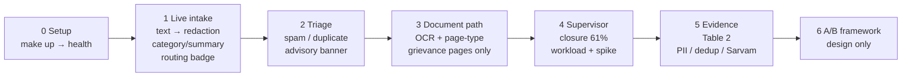

# Client demo script — 14 August 2026 (43 min scripted, ~45 min with buffer)

*Timed walkthrough on the **laptop stack** (`make up` on `127.0.0.1:8000` / `:3000`).*
*Owner: one accountable engineer · Rehearsal gate: [`scripts/demo_rehearsal.sh`](../scripts/demo_rehearsal.sh) (via PR #203) · Bring-up: [`DEMO.md`](DEMO.md) · Delivery: [`DELIVERY.md`](DELIVERY.md) Table 1 · Plan: [`docs/plans/2026-08-08-demo-integration-rehearsal.md`](plans/2026-08-08-demo-integration-rehearsal.md) Part 3*

This script is the **spoken walkthrough** for the client demo. The runbook for bringing the stack up is [`DEMO.md`](DEMO.md); the automated freeze gate is [`scripts/demo_rehearsal.sh`](../scripts/demo_rehearsal.sh) (via PR #203 — see [DEMO.md §7](DEMO.md#7-rehearsal-gate-13-aug)). Nothing here pulls from `data/` — all live samples are synthetic or pre-approved.

---

## Privacy preamble — say this first (1 min, inside Scene 0)

> "Everything you will see run live uses **synthetic or pre-approved samples** — never real citizen records — unless the Executive Director has signed off for this audience and login. That rule comes from [DELIVERY.md Table 4](DELIVERY.md#decisions-needed): whether the audience may see real data, and under whose login, is a 7 August decision. Historical text that powers the intelligence panels has already been redacted with the same Presidio step the live path uses before any matching runs. No page image or grievance text leaves the laptop — Sarvam calls, if shown, are on the pre-approved sample and are declared in the benchmark, not in this live submit."

If the audience has **not** been cleared for real data, keep the browser on the synthetic grievance below and on the published aggregates only. Do not switch to a lake query or a `psql` table scan to "show a real one."

---

## OLTP vs lake — the one gap to name out loud

Live submissions are **OLTP-immediate, lake-delayed**:

- `POST /grievance` → `GET /grievance/{id}` reads **OLTP** (`live_grievances`) and returns in seconds.
- `GET /history` and the history browse read the **Parquet lake** (`data/interim/`), which is a materialized copy via `janasunani-materialize`. A grievance you just submitted appears in history **only after the next re-materialization** — on a fresh laptop DB the history may be empty even though the round-trip read succeeds. That is by design; see [`ROADMAP.md` §3](ROADMAP.md#3-architecture-in-brief) and [`DEMO.md` §5](DEMO.md#5-drive-a-submission).

Say it when you submit: *"You will see this grievance immediately on its own page; the browse list catches up after the next materialize — that lag is intentional."*

---

## Timing overview (43 min scripted, ~45 min with buffer)

| Scene | Time | What to show | Fallback if the live path is slow or flat |
|---|---|---|---|
| **0. Setup** | 5 min | `make models && make up`; confirm health `processor:"pipeline"` | Pre-warm BART before the room is seated; use text-only if OCR stalls |
| **1. Live intake** | 8 min | Submit English text grievance on `/`; show redaction, category, summary, routing badge (`learned` + evidence tooltip) | If `learned` missing, explain `rules` → `fallback` ladder |
| **2. Advisory triage** | 5 min | Triage banner: spam score, duplicate states | If scorer absent, show `Unavailable` honestly — advisory never blocks |
| **3. Document path** | 7 min | Upload synthetic/approved PDF; show OCR + page-type gate | Fall back to a pre-submitted result if OCR stalls |
| **4. Supervisor intelligence** | 10 min | `/supervisor`: closure ladder (61% talking point), workload (filings vs distinct problems), one spike | If dedup panels are `Unavailable*`, show closure-only per [DELIVERY.md](DELIVERY.md) |
| **5. Evidence table** | 5 min | PII per-entity table, dedup prevalence (55,544 / 10,963 groups), Sarvam divergence; benchmark Table 2 | Present methodology + cached outputs if live Sarvam fails |
| **6. A/B framework** | 3 min | Design slide only — no live software | N/A |

Total with preamble and buffer: **~45 min** including questions. If time is short, cut Scene 3 (7 min) to fit 30–38 min and keep Scenes 4–5.



---

## Scene 0 — Setup (5 min)

**Goal:** prove the stack is the real pipeline, not the mock.

1. In a terminal, from a clean checkout on `main` at the frozen tag:
   ```bash
   make models          # scoped DVC pull — only categorizer + page-type ViT
   make up              # throwaway Postgres on :5544, API on :8000, frontend on :3000
   ```
   Narrate: *"Models come from our DVC mirrors under `models/` only — we never run an unqualified `dvc pull` because the workspace also tracks PII-bearing dumps."* (see [DEMO.md §1](DEMO.md#1-prerequisites)).
2. Wait for the health gate the Makefile already polls:
   ```bash
   curl -s http://127.0.0.1:8000/health
   # {"status":"ok","processor":"pipeline"}
   ```
   If `processor` is `"mock"`, a stale `janasunani-api` is squatting on the port — `make down` and retry. `mock` on this entry point is a bring-up bug, not a degraded mode.
3. Show the frontend at `http://127.0.0.1:3000` — the submit page should load.

**Talking point:** model warm-up is the slow part. The summarizer (`facebook/bart-large-cnn`, ~1.6 GB) is fetched from the Hugging Face hub on first boot, not DVC-mirrored. Pre-warm it on a good connection the night before; on macOS `serve.py` sets `HF_HUB_DISABLE_XET=1` to avoid the `hf_xet` hang documented in [DEMO.md §6](DEMO.md#6-known-limitations). If the room is waiting, keep talking through the privacy preamble while the API warms.

**Fallback:** if OCR dependencies are slow, stay on the text path for Scenes 1–2 — text needs no `tesseract`/`poppler` at submit time beyond what preflight already checked.

---

## Scene 1 — Live intake (8 min)

**Goal:** one typed grievance, end to end, with every pipeline output visible.

1. On `/`, submit a **synthetic English grievance** with a district (Sambalpur makes the slice concrete):
   > "The village water supply has been contaminated for weeks; the panchayat has not responded. Applicant: Ramesh Behera, phone 9876543210, email ramesh.behera@example.com. Please restore safe drinking water."

   District: `Sambalpur` (or `Cuttack` / `Khordha` — any district in the routing table).

2. Walk the response fields in order, pointing at the UI (or `curl` JSON if the UI is not yet styled):

   - **Redaction** — `redaction.redacted_text` with `spans` marked; show the name/phone/email replaced by typed tokens. Note: PII offsets are over the *original* text, and raw page text never reaches downstream outputs (see [`ROADMAP.md` §3.2](ROADMAP.md#32-what-is-actually-pii-free-and-where)).
   - **Category** — `classification.category` (MuRIL). Name the category and note the spread: the headline 71% spans ~0.85 for police cases to ~0.51 for social welfare — we report the spread, not the average.
   - **Summary** — one-paragraph BART summary of the redacted text.
   - **Routing badge** — `routing.dept`, `routing.office` (if mapped), `routing.confidence`, and **`routing.method`**.

**Routing ladder fallback — say this verbatim if `method` is not `learned`:**

> "Routing degrades through a ladder: **`learned` → `rules` → `fallback`**. `learned` means the crosswalk at `janasunani/routing/reference/routing_crosswalk.json` matched this category+district with empirical evidence — hover the badge for `support` and `share`. `rules` means the DVC-tracked department mappings matched but the learned crosswalk did not. `fallback` routes to the general grievance cell with low confidence rather than failing. `method: "mock"` on this stack would be a bug — the real processor never reports `mock` (see [DEMO.md §4](DEMO.md#4-launch--health-gate) and [PERFORMANCE.md §1](PERFORMANCE.md#1-live-demo-path)). `fallback` is **not** proof the artifact is missing — `Crosswalk.lookup()` legitimately returns `None` when no entry matches this category+district or when the best entry's `confidence < 0.3` (`MIN_CONFIDENCE`), then falling through to `rules` → `fallback`. Distinguish the cases via the rehearsal gate (Phase C): a missing `routing_crosswalk.json` fails with 'crosswalk missing' — only then run `janasunani-build-crosswalk` — while an unmatched or low-confidence `fallback` is a valid route."

Concrete `curl` you can paste if the UI is not up:

```bash
curl -s -X POST http://127.0.0.1:8000/grievance \
  -F "text=The village water supply has been contaminated for weeks; the panchayat has not responded." \
  -F "district=Sambalpur" | python3 -m json.tool
# expect: extraction.source=="text", redaction.redacted_text, classification.category,
#         summary, routing.method in {"learned","rules","fallback"}, triage.spam.spam_score
```

Verify the round-trip — this is the OLTP proof:

```bash
curl -s http://127.0.0.1:8000/grievance/<id> | python3 -m json.tool
# must match the POST response; history may still be empty (lake lag, expected)
```

---

## Scene 2 — Advisory triage (5 min)

**Goal:** show the triage banner is **advisory, never blocking**.

On the result card, point to the **triage banner**:

- `triage.spam.spam_score` in `[0, 1]` with `triage.spam.label` — e.g. `low-signal: <reason> (spam_score 0.82)`. The score is informational; submission always succeeds.
- `triage.duplicate_review.decision` — one of `possible duplicate of #NN` / `campaign — N filings grouped as one issue` / `no duplicate found`. Officer-facing linkage, not a rejection.
- Campaign vs duplicate distinction: a campaign of many citizens on one road is one problem arriving many times; dedup groups carry that linkage.

**Fallback:** if the spam scorer or dedup index is absent, the banner shows `Unavailable` or the `triage` fields are thin — name that honestly: *"The scorer is not wired on this laptop build; the field stays `Unavailable` rather than inventing a score. Submission still succeeds — triage never blocks."* The automated gate in [`scripts/demo_rehearsal.sh`](../scripts/demo_rehearsal.sh) checks that the schema is valid and that `spam_score` is numeric when present.

Do not present a missing scorer as a product decision — present the `Unavailable*` surface as the deliberate contract for missing aggregates.

---

## Scene 3 — Document path (7 min)

**Goal:** prove the OCR + page-type gate on a scanned page, without using real citizen documents.

1. Upload a **synthetic or pre-approved sample PDF/image** — the committed fixture `tests/fixtures/demo_letter.png` exists for this purpose. Never pull a file from `data/` for the client-facing upload.

   ```bash
   curl -s -X POST http://127.0.0.1:8000/grievance \
     -F "file=@tests/fixtures/demo_letter.png;type=image/png" \
     -F "district=Khordha" | python3 -m json.tool
   ```

2. Narrate the two gates the pipeline applies:
   - **OCR** (`extraction.ocr_model: "pytesseract"` + `extraction.pages` + `extraction.extracted_text`) — Poppler renders PDFs via `pdftoppm`/`pdfinfo`; Tesseract extracts text (Oriya requires `ori` traineddata — see pre-demo checklist). `ExtractionResult` has scalar fields `ocr_model`/`pages`/`extracted_text`; there is no `pages[]` array.
   - **Page-type filter** — only grievance-bearing pages (`Letter` / `Form` / `Text`) are fed to PII → summarizer → categorizer. A document with no such page is rejected with **HTTP 422** — that is the gate working, not an error to hide.

3. Show the same downstream fields as Scene 1 now populated from the document: `extraction` (with `ocr_model`/`pages`/`extracted_text`), `redaction`, `classification`, `summary`, `routing`, `triage`.

**Fallback:** if OCR stalls or `tesseract`/`poppler` is missing, fall back to a **pre-submitted result** (a captured JSON from a prior `make up` run) and walk the same fields. Do not install packages live in the demo — the rehearsal gate checks them the night before.

State the timing honestly: first document after boot is slower (~9–10 s) than warm text submits (median ~4.4 s on the laptop; see [PERFORMANCE.md §1](PERFORMANCE.md#1-live-demo-path)).

---

## Scene 4 — Supervisor intelligence (10 min)

**Goal:** the one place the demo earns its keep — three facts no SQL dashboard produces, plus the one that needs no ML at all.

Open `/supervisor` (or `GET /supervisor` — the API route; the frontend page is also `/supervisor` on port 3000). The page reads **published aggregates** from `DATA_DIR/aggregates/` or `JANASUNANI_SUPERVISOR_FINDINGS_DIR` (small CSVs), with strict schema allowlist + reconciliation. An `Unavailable*` panel means the aggregate is missing or stale, not that the number is zero.

Walk three panels in order:

### 4a. How cases are closed — the 61% (2 min, the headline)

> "Of the **776,922 complaints closed with one of the standard disposal phrases** — *disposed*, *disposed with appropriate action*, *disposed with the beneficiary benefited* — **61% use the wording that claims no action**, while the more specific wording was available and used 304,140 times."

Then give the three qualifiers **in the same breath** — wherever the number travels:

1. **The denominator matters.** That 61% is of complaints closed on a standard disposal phrase — about two-thirds of all resolved complaints. Measured against *every* resolved complaint the figure is **39%**, because a third close on some other wording entirely.
2. **It rises with work done.** 58% where three to five steps were recorded, **65% where six or more were**. The cases with the most movement on file are the most likely to close on the bare phrase, not the least — whatever explains the wording, it is not that nothing happened.
3. **It is a description, not a verdict.** Sometimes no action *is* the correct outcome — an information request answered, an ineligible claim properly refused, a matter already settled elsewhere. A correct closure and a premature one look identical in the record. Establishing what share was genuinely premature needs a few hundred cases read by hand — that is not August work, and we do not present the figure as though it were.

Close with the handover: *"The 61% itself needs no machine learning. We hand it over as a **query the department can run for itself**. The value we add is narrower: whether a no-action closure brings the citizen back — that needs the same-issue matching from Scenes 2 and 4b, so it identifies cases worth reviewing, not cases decided wrongly."*

Source: [DELIVERY.md §"On the intelligence layer" ¶4](DELIVERY.md#on-the-intelligence-layer) and the closure finding at `janasunani/analytics/findings/closure.py` (`janasunani-closure-finding`).

### 4b. Duplicate-adjusted workload (4 min)

> "The portal counts **filings**. This counts **problems**."

Show `workloadPanel`: filings vs distinct problems vs distinct citizens for the demo slice. The slice is fixed via [#64](DELIVERY.md) as **Sambalpur 2024 — 55,544 complaints with grievance text** (Ganjam 46,678; Balangir 38,248). The backfill over this slice completed 07 Aug 14:14 on the CPU box: **55,544 of 55,544 indexed, 10,963 duplicate groups, 16,138,623 comparison pairs** (`janasunani/config.py:DEMO_SLICE_LABEL`). All overnight jobs read that constant.

If the dedup digest is stale, the panel shows `Unavailable*` (the lake/OLTP separation is enforced by a digest check — see [`ROADMAP.md` §3](ROADMAP.md#3-architecture-in-brief) and `janasunani/pipeline/dedup_index.py`). Name it as a capability gap, not a zero.

### 4c. One spike, with cause attached (4 min)

Show `spikePanel`: one real spike with **three numbers** — filings, distinct problems (via dedup groups), distinct citizens. Narrate the two cases that are identical in a count but opposite in response:

- Four hundred citizens about one road → one coordinated response.
- Two hundred unrelated problems arriving together → triage and routing.

Detecting the spike is ordinary; telling the two cases apart is not — that is the dedup contribution. If themes are available for one category, show them as the fourth fact: local issue themes grouped by substance (redacted text), filtered to concentrated + rising.

**Fallback:** if dedup panels are `Unavailable*`, show **closure-only** per [DELIVERY.md](DELIVERY.md) — closure needs no dedup and is the one panel that always has a value.

---

## Scene 5 — Evidence table (5 min)

**Goal:** replace trust with tables — every DELIVERY Table 1 row has either a live moment or a reconciled artifact.

Put one slide or terminal output on screen. The canonical quality ledger is
`outputs/benchmark/full_benchmark.md` (and `.json`), generated by the governed
DVC bundle. `outputs/benchmark/table2.md` is the older presentation table over
latency, PII and cached Sarvam inputs only; it is not the full quality record.
If the full bundle is unavailable, walk the same numbers from the governed
sources below — do not fabricate a table.

### Table 2 — what to show

Use the generated `outputs/benchmark/full_benchmark.md`, not a hand-copied
table. The current bundle is development-only and
`publication_ready=false`. The presenter may summarize these measured results
only with the limitation in the same sentence:

| Capability | Development evidence | Required qualification |
|---|---|---|
| Actionability review | 94.74% accuracy and 13/13 non-actionable review recall (n=57) | Frontier-adjudicated binary development set; advisory only; not release-eligible |
| Categorization | 46.55% top-1 / 90.89% top-3 (n=3,160) | Historical-label agreement, not policy correctness |
| Routing | 45.14% top-1 / 69.04% top-3 (n=208,267) | Historical-destination agreement, not correct authority or outcome |
| Summary | 55/84 critical facts; 8/26 usable without edit; 4/26 residual PII | Enriched single-frontier-judge set, not officer-confirmed |
| Sarvam OCR | 56 cached paired successes; every normalized pair differed | Divergence/coverage only; no transcription accuracy, latency distribution or new spend |
| Efficiency | Typed p50 0.133 s; PDF p50 13.661 s in the governed synthetic run | Development laptop timing, not officer time saved or a release SLO |

The full denominators, confidence intervals and blockers are in
[PERFORMANCE.md §0](PERFORMANCE.md#0-full-development-benchmark-bundle--11-august-2026)
and [QUALITY_BENCHMARKS.md](QUALITY_BENCHMARKS.md). Older DSI numbers are
historical context only and must not be used as current-model evidence.

**How to talk about PII honestly (the DELIVERY note):** 77.9% any-overlap against the historical 80.6% is close, but the denominators and the strictness differ, so it is not a like-for-like comparison in either direction. Per entity: phone 0.83, Aadhaar 0.86, email 0.75, **names 0.78** — and names are 404 of the 480 scored spans, so they set the headline. Names were 0.44 until the surname gazetteer and ALL-CAPS recogniser landed on 7 August; `en_core_web_sm` alone was not built for Odia personal names.

Three things to say before anyone else says them. **Exact-span is 55.0%**, so a name is usually touched and often not fully covered — quote the any-overlap number only alongside the exact one. **The recogniser now over-fires**: 824 predicted spans against 480 in the gold (730 name spans against 404). The gold cannot separate a name the labeller missed from an over-redaction, so we report no precision figure; over-redaction costs the officer the context they need. **The gate does not pass** — coverage 78.3% sits under the 80.56% legacy constant it is compared against, and that constant is the DSI reference number that everything else in this repo calls not-a-target.

The 50-document sample is small; bank-account and scheme numbers have no gold labels (0 labelled, 20 and 2 predicted) and are covered by the corpus scan, not the figure. The gold carries no language field, so there is **no by-language breakdown** — every record scores as one `unknown` bucket.

### Sarvam — what the benchmark actually compares

- **Digitise (OCR)** — `sarvam_markdown` vs `pytesseract_text` divergence rate, with handwritten/printed split. No ground truth; methodology is the deliverable.
- **Extract (structured fields)** — Sarvam Vision `extract(schema)` category vs recorded `grievance_category` (the decision-relevant number, with paired CI) and summary divergence (exploratory). One page is **two billed calls** if both arms run: ₹0.50 digitise + ₹1.00 extract = **₹1.50/page** (see [`ROADMAP.md` §5.5](ROADMAP.md) and [`DELIVERY.md`](DELIVERY.md#three-sarvam-models-are-relevant)).
- **Cost model** — Sarvam pricing is in [`ROADMAP.md` §5.5](ROADMAP.md); local pipeline cost is wall-clock seconds (see [PERFORMANCE.md](PERFORMANCE.md)), with optional compute rupees only if `BENCHMARK_INSTANCE_RUPEES_PER_HOUR` is set.

**Talking point for the slide:** *"Vision Extract returns category and summary in one ₹1/page call; our pipeline runs OCR → PII → MuRIL → BART separately at compute-only cost. Here is category accuracy against the recorded ticket category, with paired confidence interval — that is the number that would change routing."*

**Fallback:** if any live Sarvam call fails or the benchmark artifact is missing, present the **methodology + cached outputs** (`outputs/sarvam/`, `outputs/benchmark/`) and the pricing constants — do not retry a billed call in front of the audience.

### Dedup prevalence — the one-line proof

> "Sambalpur 2024 — **55,544 complaints with grievance text → 10,963 duplicate groups** (16,138,623 pairs compared). The portal sees filings; the dedup index sees problems. That gap is the workload correction in Scene 4b."

---

## Scene 6 — A/B framework (3 min)

**Goal:** show the experiment design, not running software.

One design slide only — no live A/B surface exists on 14 August (see [DELIVERY.md Table 1](DELIVERY.md#what-we-deliver-on-14-august)):

- What is being tested (automation vs status quo), assignment unit, exposure, shadow instrumentation, and where AI already agrees with officers today.
- The **minimum detectable effect** and the **power calculation** — the numbers that say whether a future trial is worth running, not whether the tool is already better.
- The partner question is open: *"Whether any department has agreed in principle to a later trial, which would let us present the design with a named partner"* ([DELIVERY.md Table 4](DELIVERY.md#decisions-needed)).

Do not demo code for this component. The deliverable is the locked analysis plan.

---

## Pre-demo checklist

### The night before (run the freeze gate)

```bash
make rehearsal
# Phase A: ruff + pytest (serving + pipeline-core) + janasunani-demo-preflight
# Phase B: stack smoke — health, submission round-trip, supervisor, history, frontend
# Phase C: artifact presence — crosswalk, findings, aggregates, Sarvam scorecard
# Phase D: optional real-model smoke (JANASUNANI_RUN_MODEL_SMOKE=1)
```

The script is [`scripts/demo_rehearsal.sh`](../scripts/demo_rehearsal.sh) (via PR #203) — see [DEMO.md §7](DEMO.md#7-rehearsal-gate-13-aug). It must exit 0 on the **demo laptop** (not CI) before the 13 Aug freeze once #203 has merged; until then run the Phase A–C checks from the plan directly. If it warns about `Unavailable*` panels, that is the expected degraded state — fail only if all supervisor panels are unavailable.

Also verify:

- [ ] `tesseract --list-langs | grep ori` — Odia traineddata is **manual** (preflight checks only the binary)
- [ ] `pdfinfo -v` and `pdftoppm -h` — both Poppler binaries present
- [ ] Disk for BART cache: ~2 GB free for `facebook/bart-large-cnn` (pre-warm once: boot the API and wait for `processor: pipeline`, then `make down`)
- [ ] `dvc pull models/categorizer.dvc models/page_type_classifier/vit_type_classifier.dvc` succeeds (and `data/raw/janasunani-mappings.dvc` if you want `method: "rules"`)
- [ ] `uv sync --extra demo` and `npm ci` (frontend) are current
- [ ] Docker is running; ports `5544`, `8000`, `3000` are free (`lsof -i :8000` etc.)
- [ ] Synthetic fixtures are under `tests/fixtures/` — no file from `data/` will be opened during the demo
- [ ] `outputs/benchmark/table2.md` exists and is fresh (< 7 days old, per rehearsal Phase C) — or the PII/dedup/Sarvam fallbacks above are queued

### Morning of (15 min before the room)

- [ ] `make up` from scratch; confirm `curl -s http://127.0.0.1:8000/health` is `{"status":"ok","processor":"pipeline"}` within the 5-min window the Makefile waits
- [ ] Submit one synthetic text grievance and one synthetic document; keep both JSON responses in a terminal tab as Scene 1/3 fallbacks
- [ ] Open three browser tabs: `/` (submit), `/supervisor` (intelligence), `/history` (lake browse — may be empty, explain the lag if so)
- [ ] Open `outputs/benchmark/table2.md` (or the slide that renders it) on a fourth tab
- [ ] If showing Sarvam, confirm the egress artifact is the **Vision** model (not Akshar platform) and that the sample is the approved paired set

### Troubleshooting during the demo

| Symptom | What to say | What to do |
|---|---|---|
| `processor: "mock"` | "Wrong entry point is answering — the live processor did not start." | `make down`; `lsof -i :8000`; restart with `make up` |
| Routing `method: "fallback"` | Give the ladder talk (Scene 1) | After the demo, run `janasunani-build-crosswalk` on the mappings |
| Triage banner `Unavailable` | "Scorer not wired on this build — advisory stays honest." | Continue — submission still succeeds |
| Supervisor all `Unavailable*` | "Aggregates are missing — this panel needs the overnight publish." | Show closure-only fallback; `janasunani-publish-intelligence` after |
| History empty after submit | "Lake lag — the grievance is in OLTP; history catches up after materialize." | `curl /grievance/{id}` to prove persistence |
| BART download hangs | "Cold download on first boot — we pre-warmed it." | `HF_HUB_DISABLE_XET=1` on macOS; use cached text result |

---

## Close — what to leave them with

> "Five components in [DELIVERY.md Table 1](DELIVERY.md#what-we-deliver-on-14-august): a pipeline that runs live and redacts before it learns; duplicate-adjusted workload and a spike told apart from a surge; a closure finding of 61% that belongs to the department as a query, not to us as a verdict; a Sarvam comparison that reports divergence where it has no ground truth and accuracy where it does; and an A/B design ready for a partner. Every number you saw either ran live or came from a committed artifact with its denominator attached."

Questions, then offer the rehearsal log (`make rehearsal` output) and the benchmark artifact (`outputs/benchmark/table2.md`) as handouts.

---

*Cross-links: runbook [`DEMO.md`](DEMO.md) · rehearsal [`scripts/demo_rehearsal.sh`](../scripts/demo_rehearsal.sh) (via PR #203) · delivery [`DELIVERY.md`](DELIVERY.md) · architecture [`ARCHITECTURE.md`](ARCHITECTURE.md) · performance [`PERFORMANCE.md`](PERFORMANCE.md) · deploy [`DEPLOY.md`](DEPLOY.md)*
