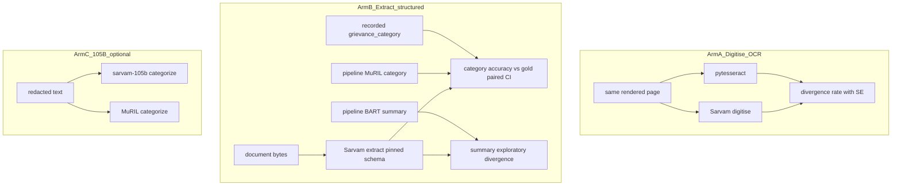
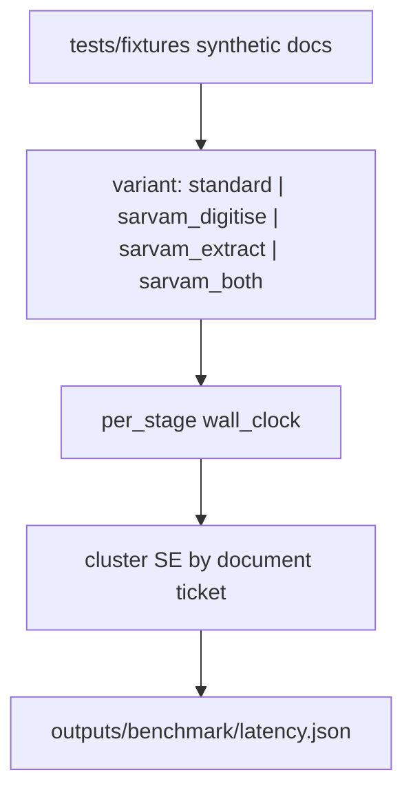
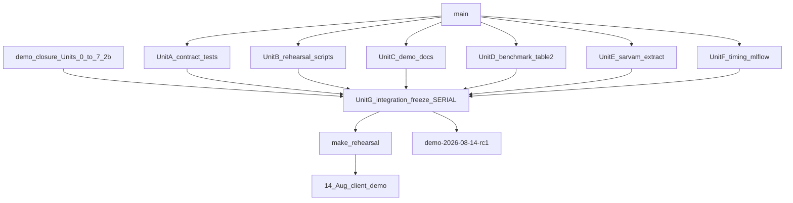

# Demo integration test and client rehearsal plan — 14 August 2026

*Date: 2026-08-08 · Owner: one accountable engineer + agents*
*Layers on: [2026-08-08-demo-closure.md](2026-08-08-demo-closure.md) · Source of truth: [DELIVERY.md](../DELIVERY.md) Table 1 · Runbook: [DEMO.md](../DEMO.md)*
*Conventions: [.dpic/standards/agent-conventions.md](../../.dpic/standards/agent-conventions.md) · Checks: [CONTRIBUTING.md](../../CONTRIBUTING.md)*

## Goal

Build a three-tier verification system (CI contract tests, laptop rehearsal script, opt-in real-model smoke) plus a client-facing demo script and benchmark Table 2 generator, so every DELIVERY Table 1 component can be shown live on the laptop stack (`make up`) with explicit pass/fail gates before the **13 Aug** freeze.

## Context

The repo already has **layered** demo coverage — API contracts ([`tests/test_serving_api.py`](tests/test_serving_api.py)), synthetic OLTP→lake→API canary ([`tests/test_e2e_synthetic.py`](tests/test_e2e_synthetic.py)), 6-stage pipeline rehearsal ([`tests/test_pipeline_e2e.py`](tests/test_pipeline_e2e.py)), opt-in real-model smoke ([`tests/test_inference_model_smoke.py`](tests/test_inference_model_smoke.py)), deploy smoke in [`deploy/deploy.sh`](deploy/deploy.sh), and local bring-up via [`make up`](Makefile) documented in [DEMO.md](../DEMO.md).

**Gap:** no single gate proves all six demo-blocking components from [2026-08-08-demo-closure.md](2026-08-08-demo-closure.md) work together on the **laptop stack**. The referenced `scripts/e2e_pipeline.sh` does not exist. CI runs only `--extra serving`, so real-model and 7-stage paths are manual.

**Target environment:** laptop (`make up` on `127.0.0.1:8000` / `:3000`), per your choice. AWS box deploy smoke stays a separate path in [DEPLOY.md](../DEPLOY.md).

---

## Demo components to verify

Map each DELIVERY Table 1 row to a **live surface** and an **artifact gate**:

| Component | Live demo surface | Automated gate |
|---|---|---|
| **13 Pipeline + PII** | Submit page → redacted text, summary, category | `GET /health` `processor:"pipeline"`; submission returns real extraction; PII scorecard CSV/MD in `outputs/findings/` |
| **14 Dedup + spam** | Triage banner on result (duplicate / campaign / low-signal) | `TriageResult` schema; `spam_score` in `[0,1]`; dedup digest constant in [`janasunani/config.py`](janasunani/config.py) |
| **9 Routing** | Routing badge: dept, confidence, `method:"learned"` | [`tests/test_routing_integration.py`](tests/test_routing_integration.py); `routing.method != "mock"` |
| **15 Intelligence** | Supervisor page: closure, workload, spike panels | `GET /supervisor` returns populated panels (not all `Unavailable*`) when aggregates exist |
| **17 Sarvam** | Benchmark table slide / `outputs/sarvam/` | Scorecard harness output exists; [`tests/test_egress_boundary.py`](tests/test_egress_boundary.py) green |
| **16 A/B** | Design slide only | Manual checklist item — no software gate |

```mermaid
flowchart LR
  subgraph tier1 [Tier1_CI]
    ContractTests[API_and_schema_tests]
    PipelineE2E[Pipeline_E2E_7stage]
    RoutingLadder[routing_learned_ladder]
    SupervisorDTO[supervisor_contract]
  end
  subgraph tier2 [Tier2_LaptopRehearsal]
    Preflight[janasunani-demo-preflight]
    MakeUp[make_up_stack]
    CurlSmoke[curl_submission_roundtrip]
    UISmoke[supervisor_and_history_pages]
    ArtifactCheck[scorecard_and_aggregate_files]
  end
  subgraph tier3 [Tier3_RealModels]
    ModelSmoke[JANASUNANI_RUN_MODEL_SMOKE]
    DocOCR[document_OCR_submission]
    E2EPipeline[scripts_e2e_pipeline_sh]
  end
  tier1 --> tier2 --> tier3
```



---

## Part 1 — Extend automated tests

### 1a. New unified contract module: `tests/test_demo_integration.py`

Single module that asserts the **frozen demo contract** end-to-end using existing patterns (no new frameworks):

- **Live app wiring** (extends [`test_e2e_synthetic.py`](tests/test_e2e_synthetic.py)): `create_live_app` selects `DatabaseResultStore` + `LakeHistory` when `OLTP_DB_URL` is set.
- **Full `GrievanceResult` shape** after submit: `extraction`, `redaction`, `classification`, `summary`, `routing`, `triage` with `spam.spam_score`, `duplicate_review.decision`.
- **Routing ladder**: when [`routing_crosswalk.json`](janasunani/routing/reference/routing_crosswalk.json) is present, `method` is one of `learned | rules | fallback` (never `mock`).
- **Supervisor**: with fixture aggregates (pattern from [`test_supervisor_intelligence.py`](tests/test_supervisor_intelligence.py)), `GET /supervisor` returns `closurePanel`, `workloadPanel`, `spikePanel` with numeric reconciliation.
- **Slice constant**: `DEMO_SLICE_LABEL == "Sambalpur/2024"` ([`test_slice.py`](tests/test_slice.py)).

Use `@pytest.mark.demo_contract` for the CI-safe subset. Heavy paths delegate to injected fakes; real models stay opt-in.

### 1b. Extend `tests/test_pipeline_e2e.py` to 7 stages

Current file stops at 6 stages and `routing: {method:"fallback"}`. Add:

- **Stage 7**: spam/signal scoring hop (or sidecar write) after PII, before page-type — matching demo-closure Unit 3→6 wiring.
- **Routing**: assert crosswalk path when artifact committed (`method:"learned"` with `empirical_evidence` for a known category+district fixture).

Keep lazy imports so CI collection still works with `--extra serving --extra pipeline-core`.

### 1c. Extend `tests/test_inference_model_smoke.py`

Under `JANASUNANI_RUN_MODEL_SMOKE=1`:

- Assert `triage.spam.spam_score` is numeric and `routing.method != "mock"`.
- Add optional `test_real_models_process_document_sample` gated on a **committed non-PII fixture** under `tests/fixtures/` (synthetic rendered page — same approach as `_make_synthetic_image` in pipeline E2E), not `data/`.

### 1d. Frontend contract (light)

Extend [`frontend/test/supervisor-contract.test.mjs`](frontend/test/supervisor-contract.test.mjs) to validate triage + routing fields in the sample `GrievanceResult` JSON used by the UI. No Playwright yet — keeps scope small.

---

## Part 2 — Laptop rehearsal script

### New: `scripts/demo_rehearsal.sh`

Orchestrates the **13 Aug freeze gate** on laptop. Exit non-zero on any failure.

**Phase A — static (no running stack)**

```bash
uv run ruff check .
uv run --extra serving --extra pipeline-core pytest \
  tests/test_demo_integration.py tests/test_pipeline_e2e.py \
  tests/test_routing_integration.py tests/test_supervisor_intelligence.py \
  tests/test_serving_triage_contract.py -m "not demo_live"
uv run --extra demo janasunani-demo-preflight
```

**Phase B — stack smoke** (assumes operator ran `make models` once)

1. Start throwaway DB + API in background (reuse Makefile logic, or require `make up` already running).
2. Poll `GET /health` until `{"status":"ok","processor":"pipeline"}` (same 5-min window as [`Makefile` `up` target](Makefile)).
3. **Text submission** — English grievance with district; assert JSON has `redaction.redacted_text`, `classification.category`, `summary`, `routing.method`, `triage.spam.spam_score`.
4. **Round-trip** — `GET /grievance/{id}` matches POST response.
5. **Supervisor** — `GET /supervisor` returns 200; log panel availability (warn if `Unavailable*`, fail only if all panels unavailable).
6. **History** — `GET /history?limit=5` returns 200 (may be empty on fresh DB — document OLTP vs lake gap per [DEMO.md](../DEMO.md) §6).
7. **Frontend** — `curl -sf http://127.0.0.1:3000` returns HTML (if frontend started).

**Phase C — artifact presence** (read-only, outside `data/`)

Check committed/published outputs exist (warn vs fail configurable):

- `janasunani/routing/reference/routing_crosswalk.json`
- `outputs/findings/` closure summary (from Unit 4a)
- `DATA_DIR/aggregates/` or `JANASUNANI_SUPERVISOR_FINDINGS_DIR` CSVs
- `outputs/sarvam/` scorecard (if Unit 5 landed)

**Phase D — optional real models**

```bash
JANASUNANI_RUN_MODEL_SMOKE=1 uv run --extra demo pytest tests/test_inference_model_smoke.py -v
```

### New Makefile target

```makefile
rehearsal:  # runs scripts/demo_rehearsal.sh
```

Document in [DEMO.md](../DEMO.md) §new section "Rehearsal gate (13 Aug)".

### Implement missing `scripts/e2e_pipeline.sh`

Referenced by [`test_e2e_synthetic.py`](tests/test_e2e_synthetic.py) docstring. Thin wrapper:

- Runs `janasunani-pipeline run` on a **non-PII fixture path** (synthetic image in `tests/fixtures/`, not `data/raw/`)
- Exports to OLTP, materializes lake slice
- Calls rehearsal curl checks

This is Tier 3 only — not CI.

---

## Part 3 — Client demo script

### New: `docs/DEMO_SCRIPT.md`

Timed **30–40 minute** walkthrough for clients on laptop. Structure:

| Scene | Time | What to show | Fallback |
|---|---|---|---|
| **0. Setup** | 5 min | `make models && make up`; confirm health | Pre-warm BART; use text-only if OCR slow |
| **1. Live intake** | 8 min | Submit English text grievance on `/`; show redaction, category, summary, routing badge (`learned` + evidence tooltip) | If `learned` missing, explain rules→fallback ladder |
| **2. Advisory triage** | 5 min | Triage banner: spam score, duplicate check states | If scorer absent, show `Unavailable` honestly |
| **3. Document path** | 7 min | Upload synthetic/approved sample PDF; show OCR + page-type gate | Fall back to pre-submitted result if OCR stalls |
| **4. Supervisor intelligence** | 10 min | `/supervisor`: closure ladder (61% talking point), workload (filings vs distinct problems), one spike | If dedup panels unavailable, closure-only per DELIVERY |
| **5. Evidence table** | 5 min | Slide or terminal: PII per-entity table, dedup prevalence (55,544 / 10,963 groups), Sarvam divergence table | Present methodology + cached outputs if live Sarvam fails |
| **6. A/B framework** | 3 min | Design slide only — no live software | N/A |

Include:

- **Privacy preamble** — use synthetic or pre-approved samples unless ED sign-off for real data ([DELIVERY.md](../DELIVERY.md) Table 4).
- **OLTP vs lake** — live submission appears in `GET /grievance/{id}` immediately; history browse is lake-backed and may lag.
- **Pre-demo checklist** (run `make rehearsal` the night before; verify Odia tesseract lang; disk space for BART cache).

---

## Part 4 — Validation matrix (when to run what)

| When | Command | Must pass |
|---|---|---|
| Every PR | `uv run --extra serving --extra pipeline-core pytest` | All existing + `test_demo_integration.py` |
| Nightly / pre-merge to main | Above + `test_pipeline_e2e.py` 7-stage | Count reconciliation |
| 12–13 Aug rehearsal | `make rehearsal` | Full Phase A–C |
| Morning of demo | `make up` + manual `docs/DEMO_SCRIPT.md` walkthrough | All scenes complete |
| Optional depth | `JANASUNANI_RUN_MODEL_SMOKE=1` + `scripts/e2e_pipeline.sh` | Real weights + document OCR |

**Do not** add real-model or BART-download steps to CI — too heavy and flaky. The rehearsal script is the intentional pre-demo gate.

---

## Files to create or modify

| Action | File |
|---|---|
| **Create** | [`scripts/demo_rehearsal.sh`](scripts/demo_rehearsal.sh) |
| **Create** | [`scripts/e2e_pipeline.sh`](scripts/e2e_pipeline.sh) |
| **Create** | [`tests/test_demo_integration.py`](tests/test_demo_integration.py) |
| **Create** | [DEMO_SCRIPT.md](../DEMO_SCRIPT.md) |
| **Create** | [`tests/fixtures/demo_letter.png`](tests/fixtures/demo_letter.png) (synthetic, no PII) |
| **Extend** | [`tests/test_pipeline_e2e.py`](tests/test_pipeline_e2e.py) — stage 7 + learned routing |
| **Extend** | [`tests/test_inference_model_smoke.py`](tests/test_inference_model_smoke.py) — triage + doc path |
| **Extend** | [`Makefile`](Makefile) — `rehearsal` target |
| **Extend** | [DEMO.md](../DEMO.md) — rehearsal section + link to script |
| **Extend** | [`tests/test_deploy_stack.py`](tests/test_deploy_stack.py) — static check that `demo_rehearsal.sh` exists and is executable |
| **Create** | `janasunani/evaluation/dsi_baselines.py`, `pricing.py`, `benchmark_report.py` |
| **Create** | `scripts/benchmark_pipeline.py`, `tests/test_benchmark_report.py` |
| **Extend** | `janasunani/evaluation/sarvam_scorecard.py` — markdown renderer + metadata join |
| **Extend** | `janasunani/tracking/mlflow_utils.py` — `log_benchmark_run()` helper |

---

## Risks and mitigations

- **BART cold download** — pre-warm during `make models` day; rehearsal script warns if hub unreachable.
- **Routing shows `fallback`** — rehearsal fails with actionable message: run `janasunani-build-crosswalk` and commit artifact.
- **Supervisor panels `Unavailable*`** — rehearsal warns; demo script uses closure-only fallback.
- **History empty after live submit** — expected on fresh laptop DB; script explains OLTP vs lake; do not patch serving to query OLTP for history.
- **PII in demo samples** — use only `tests/fixtures/` synthetic content; never pull from `data/` for client-facing walkthrough.

---

## Success definition

Demo-ready on **13 Aug** when:

1. `make rehearsal` exits 0 on the demo laptop.
2. `docs/DEMO_SCRIPT.md` walkthrough completes in under 45 minutes without code changes.
3. Every DELIVERY Table 1 row has either a live UI moment or a reconciled artifact to show.
4. Tag `demo-2026-08-14-rc1` after rehearsal passes (per demo-closure Unit 6).
5. `outputs/benchmark/table2.md` (and JSON) generated with DSI reference rows, our measurements, latency SEs, and cost columns — reproducible from scorecard modules.

---

## Part 5 — Benchmark scores, speed, cost, and pipeline switching

### What you asked for

1. **Benchmark scores** matching [Full Technical Report DPIC.pdf](../Full%20Technical%20Report%20DPIC.pdf) (DSI clinic report) — the DELIVERY Table 2 / ROADMAP §Model provenance table.
2. **Pipeline speed** documented with **standard errors** (not point estimates only).
3. **Cost** per document and per 1,000 tokens.
4. **Switchable pipeline** between standard (local) and Sarvam — possibly via MLflow.

### Assessment: what fits the demo timeline

| Ask | Verdict | Why |
|---|---|---|
| Generate Table 2 report (DSI reference + our numbers) | **In scope** | Scorecard modules exist (`pii_scorecard`, `spam_scorecard`, `sarvam_scorecard`); DSI constants are already extracted in [ROADMAP.md](../ROADMAP.md) §Model provenance. A unified renderer is ~1 day. |
| Per-stage latency with SE | **In scope (bounded)** | No shared timing module today; [PERFORMANCE.md](../PERFORMANCE.md) has manual point estimates only. A harness over synthetic fixtures (n≥20, cluster SE by document) is ~0.5–1 day. Not CI by default. |
| Cost per doc + per 1k tokens | **In scope for Sarvam; partial for local** | Sarvam pricing is documented in ROADMAP §5.5 (₹0.50/page digitise, ₹1.00/page extract, 105B token rates). Local pipeline has **no API cost** — report **wall-clock seconds/doc** and optional **compute cost** only if an instance hourly rate is configured. |
| MLflow for benchmark variant comparison | **In scope (narrow)** | [`janasunani/tracking/mlflow_utils.py`](janasunani/tracking/mlflow_utils.py) exists but nothing calls it. Using MLflow to **log benchmark runs** (`pipeline_variant=standard` vs `sarvam_ocr`) is low-risk and aligns with Phase 6→17 roadmap. |
| MLflow to **switch live serving** at runtime | **Out of scope for 14 Aug** | Live API ([`janasunani/inference/`](janasunani/inference/)) has no Sarvam path; only batch OCR switches via CLI. Wiring Sarvam into live requests needs egress governance, latency budget, and UI changes — a separate PR after demo. |
| Full provider registry (`local \| sarvam-hosted \| sarvam-selfhosted`) | **Out of scope for 14 Aug** | ROADMAP Phase 17 target; only `sarvam-vision` egress exists. Sarvam-105B categorization is schema-only in scorecard, not wired. |
| Deploy MLflow server on demo stack | **Out of scope** | [DEPLOY.md](../DEPLOY.md) explicitly keeps `mlflow` absent from demo compose. Use **local file store** (`file://…/mlruns`, already in [`config.py`](janasunani/config.py)) for benchmark runs on the laptop. |

**Bottom line:** Benchmark report + timed/cost harness + MLflow **experiment logging** is achievable in the demo window. MLflow as a **runtime pipeline switch** in live serving is too much change; use the **existing CLI flags** for batch comparison and log the variant as an MLflow param.

### Sarvam: what is and is not accounted for today

You are right to flag this — **structured field extraction is designed but not wired in the benchmark runner.**

| Sarvam capability | Egress API | Scorecard expects it? | Sample runner today? |
|---|---|---|---|
| **Digitise** (OCR → Markdown) | `adapter.digitise()` in [`egress/sarvam.py`](janasunani/egress/sarvam.py) | Yes — `pytesseract_text` vs `sarvam_markdown`, divergence rate | Yes — [`scripts/analysis/sarvam_sample.py`](scripts/analysis/sarvam_sample.py) calls only `digitise()` |
| **Extract** (schema → JSON fields) | `adapter.extract(schema=…)` — separate endpoint, **₹1.00/page** | Yes — primary outcome label is *"Category accuracy difference (Sarvam **Extract** vs pipeline categorizer)"*; `PageRecord.sarvam_category` | **No** — `extract()` is tested in [`tests/test_sarvam_egress.py`](tests/test_sarvam_egress.py) but never called in the benchmark path |
| **Category via recorded ticket** | N/A (referee = OLTP `grievance_category`) | Yes — `gold_category`, `pipeline_category` fields on `PageRecord` | **No** — metadata join from lake/OLTP not implemented |
| **Summary comparison** | Extract schema field `summary` | Not yet — no `sarvam_summary` / `pipeline_summary` on `PageRecord` | **No** |
| **Sarvam-105B** text categorizer/summarizer | Not wired in egress | Mentioned in demo-closure Unit 5 as optional arm | **No** — distinct from Vision Extract; defer unless time remains |

**Implication:** The scorecard statistics ([`build_scorecard()`](janasunani/evaluation/sarvam_scorecard.py)) are ready for the category arm, but the runner feeds empty `sarvam_category` / `gold_category` / `pipeline_category`, so the headline metric cannot be produced until Extract + metadata join land.

**ROADMAP guardrails** (must stay in the report, not hidden):

- Digitise answers *"how does OCR text differ?"* — divergence only when no transcription ground truth.
- Extract answers *"can Sarvam pull structured grievance fields in one call?"* — category vs recorded `grievance_category` is the decision-relevant comparison; this is **not** an OCR substitute ([ROADMAP §5.5](../ROADMAP.md)).
- A schema field like `complainant_name` is a **capability demo**, not evidence that PII redaction is solved (#92) — keep PII scorecard on Presidio, separate row in Table 2.
- Digitise + Extract on the same page are **two billed API calls** (₹0.50 + ₹1.00 = **₹1.50/page**); the benchmark must record which arms ran.

### Three Sarvam benchmark arms (add to Unit 5)



**Arm A — Digitise (existing, extend):** paired OCR divergence, handwritten/printed split. No category/summary.

**Arm B — Extract (new, primary for categories/summaries):**

1. **Pin schema before any output is read** — new `janasunani/evaluation/sarvam_grievance_schema.py` (versioned, e.g. `GRIEVANCE_EXTRACT_SCHEMA_V1`):

   ```python
   # illustrative — final field names aligned to OLTP category taxonomy
   {
     "grievance_category": {"type": "string", "description": "ROS category label"},
     "summary": {"type": "string", "description": "One-paragraph grievance summary"},
     "district": {"type": "string"},
     "grievance_text": {"type": "string"},
   }
   ```

2. **Extend `PageRecord`** with `sarvam_summary`, `pipeline_summary` (optional exploratory arm); map `extract()` JSON → `sarvam_category`, `sarvam_summary`.

3. **Metadata join** (ticket-level, from lake/OLTP slice — redacted metadata only):
   - `gold_category` ← `complaints.grievance_category`
   - `pipeline_category` ← artifact DB / categorizer output on same ticket
   - `pipeline_summary` ← BART output
   - `handwritten`, `language` ← `pages` columns

4. **Runner flags** on `janasunani-evaluate-sarvam`:
   - `--arm digitise` (default, current behaviour)
   - `--arm extract` (structured fields only)
   - `--arm both` (digitise + extract — full capability demo, ₹1.50/page)

5. **Scorecard output:** `build_scorecard()` already computes category paired diff; add `summary_divergence` exploratory block (normalised text diff rate, no gold referee unless DSI usefulness re-run is commissioned).

**Arm C — Sarvam-105B (optional, post-demo unless time):** categorize/summarize **redacted text** via text API; token-costed per ROADMAP rates. Different question from Vision Extract (text model vs document-intelligence schema). Log as separate MLflow variant `sarvam_105b_text`, not merged into Extract headline.

### Pipeline variants (update MLflow params)

| `pipeline_variant` | What runs | Cost model | Table 2 rows |
|---|---|---|---|
| `standard` | Local pytesseract + Presidio + MuRIL + BART + routing | compute seconds only | All local measurements |
| `sarvam_digitise` | Sarvam Vision digitise in OCR stage only; rest local | ₹0.50 × pages | OCR divergence |
| `sarvam_extract` | Sarvam Vision extract (schema) at document level; PII still local Presidio on extracted text if ingested | ₹1.00 × pages | Category accuracy vs gold; summary exploratory |
| `sarvam_both` | Digitise + Extract on same sample (capability showcase) | ₹1.50 × pages | All Sarvam rows |
| `sarvam_105b_text` | Optional text-model arm on redacted corpus | ₹/1k tokens | Category/summary if wired |

Batch switching uses existing CLI for OCR (`--ocr-engine sarvam --enable-sarvam`) plus new `--sarvam-extract` flag on the evaluate CLI (not live serving). MLflow logs which arms executed so runs are comparable.

**Not in scope for 14 Aug:** wiring Extract into `janasunani-api-live` so clients can toggle Sarvam in the submit UI — that is post-demo serving work behind egress kill-switch.

### DSI reference scores (source of truth)

The PDF is referenced at [Full Technical Report DPIC.pdf](../Full%20Technical%20Report%20DPIC.pdf) but is **not in the git tree** (likely local-only). Do not parse the PDF at runtime — codify the surviving numbers from ROADMAP (already transcribed from the report) in a new module:

**`janasunani/evaluation/dsi_baselines.py`** — frozen constants, labelled `reference_only=True`:

| Stage | Metric | DSI value |
|---|---|---|
| Format classifier | avg accuracy | 75.71% |
| OCR (English, heuristic gates) | all-three pass rate | 77.89% |
| PII | any-overlap / exact-span | 80.56% / 50.00% |
| Page-type ViT | accuracy | 0.67 |
| Categorizer MuRIL | accuracy (typed subjects) | 0.7104 |
| Summarizer BART | usefulness (0–3) | 1.9 (text-only) |
| Efficiency (clinic, per 500 tokens, A100) | format / OCR / PII / page-type / summarizer / categorizer | 4.53s / 18.86s / 4.67s / 2.49s / 1.84s / 2.82s |

Our measurements (from existing/planned scorecards) sit **alongside**, never as thresholds — per DELIVERY Table 2 caveats (different samples, English-only DSI, name-heavy PII gold).

### Unified benchmark report generator

**New:** `janasunani/evaluation/benchmark_report.py` + console script `janasunani-evaluate-benchmark` (mirror [`spam_scorecard.py`](janasunani/evaluation/spam_scorecard.py) `render_markdown()` pattern).

**Inputs** (each optional; missing → `not_measured` row, not fabricated):

| Source module | Table 2 row |
|---|---|
| `pii_scorecard` gold run | PII per-entity recall + corpus scan |
| `sarvam_scorecard.build_scorecard()` | OCR divergence; **Extract category** paired CI vs gold; summary exploratory; per-category spread |
| `spam_scorecard` | Spam prevalence (bounded) |
| `dedup_index` stats / config constants | Duplicate groups over slice |
| `dsi_baselines` | Reference column |
| `benchmark_pipeline` harness | Our latency + SE per stage |
| `pricing` module | Cost columns |

**Outputs** (committed or in `outputs/benchmark/`):

- `table2.json` — machine-readable, feeds demo slide
- `table2.md` — human-readable DELIVERY Table 2 + latency/cost appendix
- `FINDINGS.md` fragment (optional cross-link)

**Extend** [`sarvam_scorecard.py`](janasunani/evaluation/sarvam_scorecard.py):

- Add `render_markdown(report) -> str` and `write_outputs(dir)` (today only JSON via [`scripts/analysis/sarvam_sample.py`](scripts/analysis/sarvam_sample.py), which is **digitise-only**).
- Promote into `janasunani-evaluate-sarvam` CLI with:
  - `--arm {digitise,extract,both}`
  - `--join-metadata` from lake/OLTP for `gold_category`, `pipeline_category`, `pipeline_summary`, `handwritten`, `language`
  - `--schema-version v1` (pins [`sarvam_grievance_schema.py`](janasunani/evaluation/sarvam_grievance_schema.py))
- Add `summary_divergence` exploratory metric when `sarvam_summary` + `pipeline_summary` present.

### Pipeline speed with standard errors

**New:** `scripts/benchmark_pipeline.py` (and thin wrapper `janasunani-benchmark-pipeline` if desired).



**Design:**

- Run each variant over **n documents** (default 20 text + 10 synthetic page images) with **k repeats** where warm (discard first request).
- Record wall time per stage: format, OCR, PII, spam, page-type, summarize, categorize, route (live path uses `PipelineGrievanceProcessor`; batch path uses artifact DB stage hooks).
- **Cluster SE by ticket/document** — reuse the ticket-clustering logic from [`sarvam_scorecard.py`](janasunani/evaluation/sarvam_scorecard.py) (pages from one complaint are correlated).
- Report: `mean_seconds`, `se_seconds`, `n_clusters`, `p50`, `p95` per stage and **end-to-end**.
- Append results to [PERFORMANCE.md](../PERFORMANCE.md) §1 automatically via `table2.md` (manual PERFORMANCE.md update optional post-demo).

**Standard variant:** `ocr_engine=pytesseract`, local models.

**Sarvam digitise variant:** `ocr_engine=sarvam --enable-sarvam` on batch path.

**Sarvam extract variant:** `janasunani-evaluate-sarvam --arm extract` (document-level; does not replace live serving).

**Timing harness:** run `standard`, `sarvam_digitise`, and `sarvam_extract` separately — Extract latency is dominated by async job poll (5s default), so do not merge into one headline without labelling the arm.

### Cost model

**New:** `janasunani/evaluation/pricing.py` — single source for ROADMAP §5.5 rates:

| Line item | Rate | Used when |
|---|---|---|
| Vision digitise | ₹0.50 / page | `--arm digitise` or `sarvam_digitise` |
| Vision extract | ₹1.00 / page | `--arm extract` or `sarvam_extract` |
| Vision both | ₹1.50 / page | `--arm both` |
| Sarvam-105B input | ₹29.28 / 1M tokens | future categorizer arm |
| Sarvam-105B output | ₹73.20 / 1M tokens | future summarizer arm |
| Local pipeline | ₹0 API | standard variant |

**Per-document cost (Sarvam path):**

```
cost_doc = pages × rate_per_page + (input_tokens + output_tokens) / 1000 × rate_per_1k_tokens
```

Token counts: use `tiktoken` or model tokenizer where available; for OCR-only benchmark, token cost is zero and report is **₹/page only**.

**Per-1k-tokens:** report separately for categorizer/summarizer arms when Sarvam-105B is wired; until then, document as `not_applicable` with the rate constant shown for planning.

**Local path cost column:** report `api_cost_rupees=0` and `compute_seconds` (from timing harness); optional `compute_cost_rupees` only if `BENCHMARK_INSTANCE_RUPEES_PER_HOUR` env is set (off by default).

### Pipeline switching: recommended architecture

**For the 14 Aug demo — batch benchmark comparison only:**

```bash
# Standard
uv run --extra pipeline-core janasunani-pipeline run ... --ocr-engine pytesseract

# Sarvam OCR only (batch pipeline)
uv run --extra pipeline-core janasunani-pipeline run ... --ocr-engine sarvam --enable-sarvam

# Sarvam structured extract benchmark (document-level, not pipeline CLI)
uv run --extra serving janasunani-evaluate-sarvam \
  --input <sample_dir> --out outputs/sarvam/ \
  --arm extract --join-metadata --slice Sambalpur/2024
```

Both variants feed the same `build_scorecard()` / `benchmark_report` with a `pipeline_variant` tag.

**MLflow role (narrow, recommended):**

Add `log_benchmark_run()` in [`janasunani/tracking/mlflow_utils.py`](janasunani/tracking/mlflow_utils.py) or a thin `janasunani/evaluation/mlflow_benchmark.py`:

- Experiment: `janasunani-demo-benchmark`
- Params: `pipeline_variant`, `sarvam_arm`, `schema_version`, `slice_id`, `ocr_engine`, `sample_n`, `git_sha`
- Metrics: `latency_e2e_mean`, `latency_e2e_se`, `cost_per_doc_rupees`, `cost_per_1k_tokens`, `category_accuracy_pipeline`, `category_accuracy_sarvam_extract`, `category_diff_ci_low`, `ocr_divergence_rate`, `summary_divergence_rate`
- Artifacts: `table2.md`, `table2.json`, `latency.json`, `sarvam_scorecard.json`

This gives a **reproducible comparison UI** in MLflow without changing production serving. Operators re-run with `--pipeline-variant sarvam_ocr` and compare runs side-by-side.

**What MLflow should NOT do in this sprint:**

- Resolve models at inference time via `@production` aliases (no models registered yet).
- Run inside the `make up` / demo compose stack.
- Gate CI merges (file-store MLflow is local-only).

**Post-demo path** (document, do not build now):

- Provider registry in config (`JANASUNANI_OCR_PROVIDER=sarvam-hosted`).
- Live inference Sarvam path behind egress kill-switch.
- Sarvam-105B categorizer arm in scorecard + optional live A/B.

### Integration with rehearsal and demo script

Extend **Phase C** of `scripts/demo_rehearsal.sh`:

```bash
# Fail if Table 2 not generated within freeze window (warn if stale >7d)
test -f outputs/benchmark/table2.md
uv run janasunani-evaluate-benchmark --check  # validates schema, not full re-run
```

Extend **Scene 5** in `docs/DEMO_SCRIPT.md`:

- Show `outputs/benchmark/table2.md` on screen: DSI reference column vs our measurement column, latency mean±SE, cost/doc for both variants.
- Talking point: "Vision Extract returns category and summary in one ₹1/page call; our pipeline runs OCR → PII → MuRIL → BART separately at compute-only cost. Here is category accuracy against the recorded ticket category, with paired confidence interval."

### New / modified files (benchmark workstream)

| Action | File |
|---|---|
| **Create** | `janasunani/evaluation/sarvam_grievance_schema.py` (pinned Extract schema, versioned) |
| **Create** | `janasunani/evaluation/dsi_baselines.py` |
| **Create** | `janasunani/evaluation/pricing.py` |
| **Create** | `janasunani/evaluation/benchmark_report.py` |
| **Create** | `janasunani/evaluation/mlflow_benchmark.py` (or extend `mlflow_utils.py`) |
| **Create** | `scripts/benchmark_pipeline.py` |
| **Create** | `tests/test_benchmark_report.py`, `tests/test_pricing.py` |
| **Extend** | `janasunani/evaluation/sarvam_scorecard.py` — `PageRecord` summary fields, `render_markdown`, summary divergence |
| **Extend** | `pyproject.toml` — `janasunani-evaluate-benchmark`, `janasunani-evaluate-sarvam` entry points |
| **Deprecate** | `scripts/analysis/sarvam_sample.py` → thin wrapper calling `janasunani-evaluate-sarvam` |
| **Extend** | `scripts/demo_rehearsal.sh` — Table 2 artifact check |
| **Extend** | `docs/PERFORMANCE.md` — link to generated latency appendix |
| **Optional** | Add PDF to `docs/` or DVC if operators need single source — do not block on PDF parse |

### Effort estimate (adds to demo-closure Unit 5)

| Task | Days | Critical path? |
|---|---|---|
| `dsi_baselines` + `benchmark_report` renderer | 0.5 | No — parallel with Unit 5 Sarvam run |
| `pricing.py` + cost columns | 0.25 | No |
| `benchmark_pipeline.py` timing harness | 0.75 | No — run overnight once |
| MLflow run logging | 0.25 | No |
| Sarvam scorecard markdown + metadata join + **Extract arm** | 1.0 | **Yes** — category row needs `--arm extract` + join |
| Sarvam-105B text arm | 1.0 | **Deferred** unless Extract arm ships early |
| Live serving Sarvam switch | 3+ | **Deferred** |

**Total added: ~2.5 days**, mostly parallel with existing Unit 5. Minimum viable Sarvam demo: Arm A (digitise divergence) + Arm B (extract category) — Arm C (105B) optional.

---

## Part 6 — Agent breakdown (branches, worktrees, parallelism)

This plan layers on [2026-08-08-demo-closure.md](2026-08-08-demo-closure.md) Units 0–7. Follow org conventions in [.dpic/standards/agent-conventions.md](../../.dpic/standards/agent-conventions.md) (commits, branches, worktrees, subagent dispatch, review protocol) and repo checks in [CONTRIBUTING.md](../../CONTRIBUTING.md) (required `pytest`/`ruff` matrix, PII extra isolation, PR size, `@codex review`).

**Hard rules (from agent-conventions):**

- Never commit to `main`; use top-level [`.worktrees/`](.worktrees/) (already in `.gitignore`).
- One PR per logical unit; each branch must pass checks **in isolation**.
- Spawn parallel agents only when **file-disjoint**; give each agent an explicit do-not-touch list.
- Accountable engineer re-runs the full [CONTRIBUTING.md](../../CONTRIBUTING.md) check matrix on `main` after each merge — do not trust agent logs.
- No AI co-author trailers on commits or PRs.

**Worktree creation (canonical):**

```bash
git fetch origin
git worktree add .worktrees/<short-name> -b <type>/<kebab-case> main
# per-worktree: uv sync --extra <name>  (never combine conflicting extras)
# after merge: git worktree remove .worktrees/<short-name>
```

### Unit map

| Unit | Branch | Worktree | Agent(s) | Depends on | Blocks |
|---|---|---|---|---|---|
| **A** Contract tests | `test/demo-integration-contract` | `.worktrees/demo-integration-contract` | 1 parallel | `main` (+ demo-closure Unit 0 if not merged) | G |
| **B** Rehearsal scripts | `chore/demo-rehearsal-script` | `.worktrees/demo-rehearsal-script` | 1 parallel | `main` | G |
| **C** Demo docs | `docs/demo-script-and-runbook` | `.worktrees/demo-script-and-runbook` | 1 parallel | `main` | G |
| **D** Benchmark Table 2 | `feat/benchmark-report-table2` | `.worktrees/benchmark-report-table2` | 1 parallel | `main` | G |
| **E** Sarvam Extract arm | `feat/sarvam-extract-benchmark` | `.worktrees/sarvam-extract-benchmark` | 1 parallel | `main`, demo-closure Unit 5 egress ready | G |
| **F** Timing + MLflow | `feat/benchmark-pipeline-timing` | `.worktrees/benchmark-pipeline-timing` | 1 parallel | `main` | G |
| **G** Integration freeze | `chore/demo-integration-freeze` | `.worktrees/demo-integration-freeze` | **1 serial** | A–F + demo-closure 0–7,2b merged | tag `demo-2026-08-14-rc1` |

Units A–F are **independent of each other** (file-disjoint). Unit G is the only serial gate before rehearsal sign-off.

### Per-unit file ownership

#### Unit A — `test/demo-integration-contract`

**Owns:** `tests/test_demo_integration.py`, extensions to `tests/test_pipeline_e2e.py` (stage 7 + routing), `tests/test_inference_model_smoke.py`, `tests/fixtures/demo_letter.png`, `frontend/test/supervisor-contract.test.mjs` (triage/routing fields only)

**Do-not-touch:** `scripts/demo_rehearsal.sh`, `scripts/e2e_pipeline.sh`, `janasunani/evaluation/benchmark_report.py`, `janasunani/evaluation/sarvam_grievance_schema.py`, `janasunani/evaluation/sarvam_scorecard.py` (except if E not started), `Makefile`, `docs/DEMO_SCRIPT.md`

**Verify:**

```bash
uv run ruff check tests/test_demo_integration.py tests/test_pipeline_e2e.py tests/test_inference_model_smoke.py
uv run --extra serving --extra pipeline-core pytest \
  tests/test_demo_integration.py tests/test_pipeline_e2e.py -v
JANASUNANI_RUN_MODEL_SMOKE=1 uv run --extra demo pytest tests/test_inference_model_smoke.py -v  # opt-in
cd frontend && npm test
```

#### Unit B — `chore/demo-rehearsal-script`

**Owns:** `scripts/demo_rehearsal.sh`, `scripts/e2e_pipeline.sh`, `Makefile` (`rehearsal` target only), `tests/test_deploy_stack.py` (static check script exists)

**Do-not-touch:** `tests/test_demo_integration.py`, `janasunani/evaluation/**`, `docs/DEMO_SCRIPT.md` (Unit C), `janasunani/evaluation/sarvam_scorecard.py`

**Verify:**

```bash
uv run ruff check scripts/demo_rehearsal.sh scripts/e2e_pipeline.sh  # shellcheck if available
uv run --extra serving pytest tests/test_deploy_stack.py tests/test_makefile_dotenv.py -v
# dry-run: bash -n scripts/demo_rehearsal.sh
```

#### Unit C — `docs/demo-script-and-runbook`

**Owns:** `docs/DEMO_SCRIPT.md`, `docs/DEMO.md` (rehearsal section + cross-links only)

**Do-not-touch:** all `janasunani/**`, `tests/**`, `scripts/**`, `Makefile`

**Verify:** manual read-through; link check only (no pytest gate).

#### Unit D — `feat/benchmark-report-table2`

**Owns:** `janasunani/evaluation/dsi_baselines.py`, `janasunani/evaluation/pricing.py`, `janasunani/evaluation/benchmark_report.py`, `tests/test_benchmark_report.py`, `tests/test_pricing.py`, `pyproject.toml` (`janasunani-evaluate-benchmark` entry only)

**Do-not-touch:** `janasunani/evaluation/sarvam_scorecard.py`, `janasunani/evaluation/sarvam_grievance_schema.py`, `janasunani/egress/sarvam.py`, `scripts/benchmark_pipeline.py`, `janasunani/tracking/mlflow_utils.py`

**Verify:**

```bash
uv run ruff check janasunani/evaluation/dsi_baselines.py janasunani/evaluation/pricing.py janasunani/evaluation/benchmark_report.py
uv run --extra serving pytest tests/test_benchmark_report.py tests/test_pricing.py -v
uv run --extra serving janasunani-evaluate-benchmark --check  # after CLI lands
```

#### Unit E — `feat/sarvam-extract-benchmark`

**Owns:** `janasunani/evaluation/sarvam_grievance_schema.py`, extensions to `janasunani/evaluation/sarvam_scorecard.py` (`PageRecord` summary fields, `render_markdown`, summary divergence), new `janasunani/evaluation/sarvam_evaluate.py` (CLI module), `pyproject.toml` (`janasunani-evaluate-sarvam` entry), `tests/test_sarvam_scorecard.py`, `tests/test_sarvam_evaluate.py`, thin wrapper in `scripts/analysis/sarvam_sample.py`

**Do-not-touch:** `janasunani/egress/sarvam.py` (unless egress bugfix — coordinate), `janasunani/evaluation/benchmark_report.py` (Unit D), `scripts/benchmark_pipeline.py`, `janasunani/inference/**`, `janasunani/serving/**`

**Verify:**

```bash
uv run ruff check janasunani/evaluation/sarvam_grievance_schema.py janasunani/evaluation/sarvam_scorecard.py
uv run --extra serving pytest tests/test_sarvam_scorecard.py tests/test_sarvam_egress.py tests/test_sarvam_evaluate.py -v
# live run (operator, not CI): janasunani-evaluate-sarvam --dry-run ...
```

**Note:** Live Sarvam calls require egress permission + real sample path; CI uses recorded transports only ([`tests/test_sarvam_egress.py`](tests/test_sarvam_egress.py)).

#### Unit F — `feat/benchmark-pipeline-timing`

**Owns:** `scripts/benchmark_pipeline.py`, `janasunani/evaluation/mlflow_benchmark.py`, extensions to `janasunani/tracking/mlflow_utils.py` (`log_benchmark_run`), `tests/test_mlflow_utils.py`, `tests/test_benchmark_pipeline.py`

**Do-not-touch:** `janasunani/evaluation/benchmark_report.py` (Unit D merges outputs), `janasunani/evaluation/sarvam_scorecard.py` (Unit E), `scripts/demo_rehearsal.sh`

**Verify:**

```bash
uv run ruff check scripts/benchmark_pipeline.py janasunani/evaluation/mlflow_benchmark.py janasunani/tracking/mlflow_utils.py
uv run --extra serving pytest tests/test_mlflow_utils.py tests/test_benchmark_pipeline.py -v
```

#### Unit G — `chore/demo-integration-freeze` (SERIAL)

**Owns:** final wiring in `scripts/demo_rehearsal.sh` (Table 2 artifact check), any conflict resolution, version tag note in `docs/DEMO.md`, optional `outputs/benchmark/.gitkeep` if needed

**Do-not-touch:** feature code in Units A–F except merge conflict resolution

**Depends:** all of A–F merged; demo-closure Units 0–7 and 2b from [2026-08-08-demo-closure.md](2026-08-08-demo-closure.md) merged (routing crosswalk, spam scorer, intelligence panels, PII scorecard artifacts)

**Verify (full matrix — accountable engineer):**

```bash
# CONTRIBUTING.md required checks
uv lock --check
uv sync --locked --all-groups --extra serving
uv run ruff check .
uv run --extra serving --extra pipeline-core pytest
uv run dvc dag
uv run dpic-sync-standards --check

# This plan's gate
make rehearsal   # Phase A–C + optional D model smoke
```

**Freeze rule:** nothing merges after Unit G branch cut at **13 Aug 12:00**; Friday 14 Aug is demo only.

### Parallelism diagram



### Wave schedule

| Wave | When | Units | Parallel agents |
|---|---|---|---|
| **0** | Already done | demo-closure Unit 0 (slice freeze) | — |
| **1** | Day 1 | A, B, C, D, E, F | **up to 6** (file-disjoint) |
| **2** | Day 2–3 | demo-closure Units 1–7, 2b (if not already on `main`) | per closure plan (4-way Wave 1 there) |
| **3** | Day 4 | Rebase A–F onto `main` + closure merges; fix any contract drift | 1 engineer |
| **4** | 13 Aug | Unit G serial freeze + `make rehearsal` | **1 only** |
| **5** | 14 Aug | Client demo per `docs/DEMO_SCRIPT.md` | no code |

### PR checklist (every unit)

Per [CONTRIBUTING.md](CONTRIBUTING.md):

1. Self-review `git diff` against base.
2. Run unit-specific verify commands above + `uv run ruff check` on owned files.
3. Open PR; comment `@codex review` if touching pipeline, serving, evaluation, or scripts.
4. Handle findings per [agent-conventions §Handling review findings](.dpic/standards/agent-conventions.md#handling-review-findings).
5. Accountable engineer re-runs full matrix on `main` after merge.

### Relationship to demo-closure worktrees

If demo-closure units are still in flight, **do not reuse their worktrees**. This plan's units use the branch names above. Overlap is resolved at merge time on `main`:

| demo-closure unit | Overlap with this plan |
|---|---|
| Unit 3 (pipeline E2E) | Coordinate with Unit A — same `test_pipeline_e2e.py`; **one owner** (Unit A absorbs 7-stage extension) |
| Unit 5 (Sarvam) | Coordinate with Unit E — Unit E owns evaluate CLI + Extract arm; closure Unit 5 owns paired live run |
| Unit 6 (integration freeze) | Superseded by Unit G here for rehearsal + benchmark artifacts |

If both plans assign the same file, **serialize** (finish closure Unit 3 before Unit A touches `test_pipeline_e2e.py`, or merge closure first).

